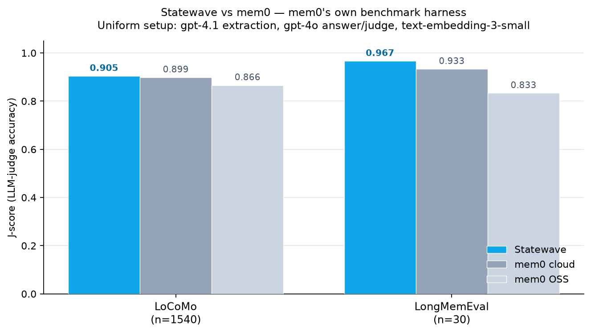

# Statewave vs mem0 — head-to-head on mem0's own benchmark

A fair, in-harness comparison of **Statewave**, **mem0 cloud**, and **mem0 OSS** on
long-term-memory benchmarks. One fixed setup — only the memory system changes.

> Fork of [`mem0ai/memory-benchmarks`](https://github.com/mem0ai/memory-benchmarks)
> (Apache 2.0). mem0's judge and scoring code are unchanged. We added a Statewave
> retrieval adapter plus a few harness fixes that **help the mem0 backends**: the
> mem0 cloud `add` endpoint (cloud ingested nothing without it), session-date
> grounding for mem0 OSS (its SDK drops the date the other systems receive), and
> BEAM ingest concurrency. All changes are listed in [`NOTICE`](NOTICE) — diff
> against upstream to verify exactly what changed.

## Results



| Benchmark | Statewave | mem0 cloud | mem0 OSS |
|---|---:|---:|---:|
| **LoCoMo** (n = 1,540) | **0.905** | 0.899 | 0.866 |
| **LongMemEval** (n = 30) | **0.967** | 0.933 | 0.833 |

**Statewave matches the paid mem0 cloud and beats mem0 OSS** — at `gpt-4o`, not
`gpt-5`. Per-question results are in
[`results/statewave_comparison/`](results/statewave_comparison/). BEAM
(long-context) benchmarking will follow.

**Setup:** the self-hosted systems (Statewave, mem0 OSS) use `gpt-4.1` extraction
and `text-embedding-3-small`; all three share `gpt-4o` answer + judge and a
top-200 retrieval request. Two product-inherent asymmetries: **mem0 cloud** runs
its own managed extractor/embedder (not configurable), and **mem0 OSS** returns
≤20 memories per query by its library default (vs ~200 for Statewave and cloud) —
so Statewave-vs-cloud, both at 200, is the cleanest comparison. This is an
in-harness test, not a reproduction of mem0's published `gpt-5` + Qwen figures.
Single run; LongMemEval is a 30-question matched set with wide error bars, so
LoCoMo (n = 1,540) is the more robust signal.

## Run it

```bash
git clone https://github.com/smaramwbc/statewave-memory-benchmarks.git
cd statewave-memory-benchmarks
pip install -r requirements.txt
export OPENAI_API_KEY=sk-...        # used for the answerer + judge
```

Run any benchmark against each backend (LoCoMo shown; swap in `longmemeval`):

```bash
# Statewave — against a running Statewave server
#   (set STATEWAVE_URL and STATEWAVE_API_KEY for your instance)
python -m benchmarks.locomo.run --backend statewave \
  --answerer-model gpt-4o --judge-model gpt-4o

# mem0 cloud — needs a Mem0 API key
python -m benchmarks.locomo.run --backend cloud --mem0-api-key "$MEM0_API_KEY" \
  --answerer-model gpt-4o --judge-model gpt-4o

# mem0 OSS — local server (docker compose up -d starts Mem0 + Qdrant)
python -m benchmarks.locomo.run --backend oss --mem0-host http://localhost:8888 \
  --answerer-model gpt-4o --judge-model gpt-4o
```

For LongMemEval, use `python -m benchmarks.longmemeval.run ...` with `--per-type 5`
for the matched set. The self-hosted systems use `gpt-4.1` extraction; for mem0 OSS
set that in `mem0-config.yaml` (see
[`mem0-config.example.yaml`](mem0-config.example.yaml)). Per-question outputs are
written under [`results/`](results/).

## How it works

Each benchmark runs **ingest → search → evaluate**: conversations are added to the
memory system, each question retrieves from it, then an answerer LLM responds from
the retrieved memories and a judge LLM scores the answer against ground truth. The
judge and scoring are mem0's, unchanged — only the memory backend differs.

## License & attribution

Fork of [`mem0ai/memory-benchmarks`](https://github.com/mem0ai/memory-benchmarks),
Apache 2.0 — [`LICENSE`](LICENSE) and [`NOTICE`](NOTICE) preserved. Benchmark
datasets (LoCoMo, LongMemEval) are not redistributed and remain under their own
licenses. "mem0" is referenced nominatively; no affiliation or endorsement is
implied.
